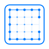

# Compute

This project provides a high-level Swift framework for working with Metal compute shaders. It simplifies the process of setting up and executing compute tasks on GPU using Apple's Metal API.

## Inspiration

This project draws inspiration from Apple's SwiftUI shaders introduced in iOS 17 and macOS Sonoma. SwiftUI shaders demonstrate how GPU operations can be made more accessible to developers, enabling complex visual effects with simple Swift code. Compute aims to provide a similar level of abstraction for Metal compute shaders, making it easier to perform data-parallel computations on the GPU.


## Usage Example

Here's a quick example of how to use the Metal Compute Framework to perform a basic computation:

```swift
import Compute
import Metal

// Example usage that adds two arrays of integers using Compute.

// Metal shader source code
let source = """
#include <metal_stdlib>
using namespace metal;

kernel void add(device int* inA [[buffer(0)]],
                device int* inB [[buffer(1)]],
                device int* result [[buffer(2)]],
                uint id [[thread_position_in_grid]]) {
    result[id] = inA[id] + inB[id];
}
"""

// Set up the compute environment
let device = MTLCreateSystemDefaultDevice()!
let compute = try Compute(device: device)

// Create input data
let count = 1000
let inA = [Int32](repeating: 1, count: count)
let inB = [Int32](repeating: 2, count: count)
var result = [Int32](repeating: 0, count: count)

// Create Metal buffers
let bufferA = device.makeBuffer(bytes: inA, length: MemoryLayout<Int32>.stride * count, options: [])!
let bufferB = device.makeBuffer(bytes: inB, length: MemoryLayout<Int32>.stride * count, options: [])!
let bufferResult = device.makeBuffer(length: MemoryLayout<Int32>.stride * count, options: [])!

// Create a shader library and function
let library = ShaderLibrary.source(source)
let function = library.add

// Create a compute pipeline and bind arguments.
var pipeline = try compute.makePipeline(function: function)
pipeline.arguments.inA = .buffer(bufferA)
pipeline.arguments.inB = .buffer(inB)
pipeline.arguments.result = .buffer(bufferResult)

// Run the compute pipeline
try compute.run(pipeline: pipeline, count: count)

// Read back the results
result = bufferResult.contents().withUnsafeBytes { $0.bindMemory(to: Int32.self) }

// Verify the results
for i in 0..<count {
    assert(result[i] == inA[i] + inB[i], "Computation error at index \(i)")
}
```

## Requirements

- iOS 16.0+ / macOS 15+

## Installation

### Swift Package Manager

To integrate the Metal Compute Framework into your Xcode project using Swift Package Manager, add it to the dependencies value of your `Package.swift`:

```swift
dependencies: [
    .package(url: "https://github.com/schwa/Compute.git", .from(from: "0.0.1"))
]
```

Then, specify it as a dependency of your target:

```swift
targets: [
    .target(name: "YourTarget", dependencies: ["MetalComputeFramework"]),
]
```

## Features

Compute is designed to reduce the amount of boilerplate setup code needed to use Metal compute shaders. It provides a high-level API for creating compute pipelines, binding arguments, and executing compute tasks on the GPU.

Compute brings type safety and Swift-friendly syntax to Metal compute programming. It uses Swift enums and structs to represent Metal objects and types, making it easier to work with Metal buffers, textures, and other resources.

Compute handles and throws errors upon resource creation, shader compilation, and compute pipeline execution. This makes it easier to catch and handle errors in your code.

Compute also automatically adds labels to most Metal resources to aid in debugging.

This screenshot shows a comparison of code using Compute to code using "bare" Metal:


## License

This project is licensed under the MIT License. See the [LICENSE](LICENSE) file for details.

## Contributing

Contributions are welcome to the Compute Framework.

Note: Some of our initial documentation and tests were AI-generated.

## Links

> [Metal Overview - Apple Developer](https://developer.apple.com/metal/)

Apple's main Metal documentation.

> - [developer.apple.com/metal/Metal-Shading-Language-Specification.pdf](https://developer.apple.com/metal/Metal-Shading-Language-Specification.pdf)

The Metal Shading Language Specification book. This is the definitive guide to writing shaders in Metal.

> - [developer.apple.com/metal/Metal-Feature-Set-Tables.pdf](https://developer.apple.com/metal/Metal-Feature-Set-Tables.pdf)

The Metal Feature Set Tables book. This is a reference for which features are available on which devices/Metal versions.

> - [Metal by Example – High-performance graphics and data-parallel programming for iOS and macOS](https://metalbyexample.com)

Warren Moore's blog is the single best resource for learning Metal programming.

> - [Introduction to Compute Programming in Metal – Metal by Example](https://metalbyexample.com/introduction-to-compute/)

Warren has some posts on Compute programming in Metal but they're showing their age a bit. Nevertheless, they're a good starting point.

> - [Shader | Apple Developer Documentation](https://developer.apple.com/documentation/swiftui/shader)

SwiftUI's Shader was the primary inspiration for this project.

> - [Calculating Threadgroup and Grid Sizes | Apple Developer Documentation](https://developer.apple.com/documentation/metal/compute_passes/calculating_threadgroup_and_grid_sizes)
> - [Creating Threads and Threadgroups | Apple Developer Documentation](https://developer.apple.com/documentation/metal/compute_passes/creating_threads_and_threadgroups)

How to calculate threadgroup and grid sizes. This is a critical concept in Metal compute programming.
